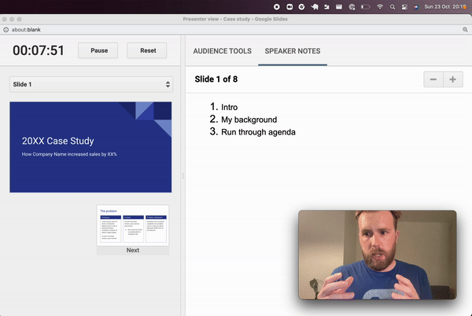

# Overview

When delivering a presentation, over 90% of your communication is done non-verbally.

Pharus is cross platform desktop app that offers real-time feedback on your body language.

Deliver presentations and talks with more impact. Works perfectly with all conferencing (e.g. Zoom) and presentation software (e.g. Google Slides).

Keep your eye on the toolbar at the top.

# The Name
## Meaning
Pharus means lighthouse. Lighthouses are designed to keep ships away from the rocks, much like how Pharus is meant to keep a speakers away from common public speaking pitfalls. 

## Pronunciation
Far - us

# Features
- [x] Touching face
- [ ] Speaking pace
- [ ] Filler words
- [ ] Vocal dynamics